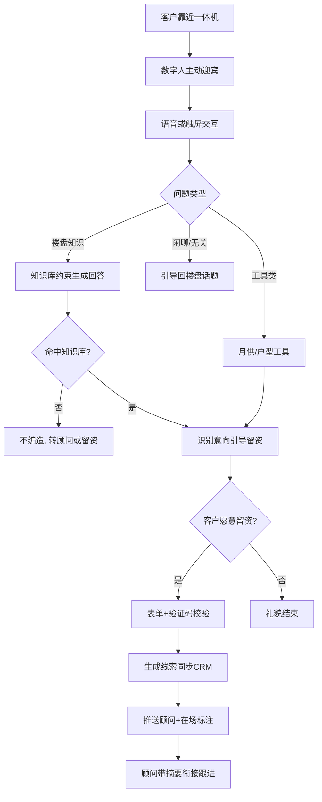
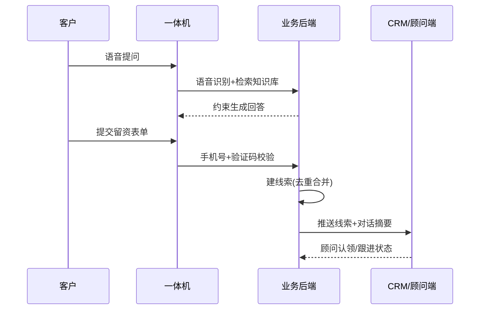

# PRD：「AI 案场接待官」【待定名称】—— 售楼处 AI 数字人接待一体机

| 文档信息 | 内容 |
|---|---|
| 版本 | v0.1（草稿） |
| 状态 | 待评审 |
| 本期范围 | 迎宾 + 楼盘问答 + 线索登记与分发（一体机 + 数字人，软硬分离设计） |
| 变更记录 | 首次创建 |

## 1. 背景与目标

### 1.1 业务背景
售楼处客户接待完全依赖置业顾问人工：高峰时段多组客户同时到访时，未被即时接待的客户等待甚至流失；区位、户型、优惠等基础问题被顾问重复回答，占用本应用于意向沟通的时间；散客到访若当日无人跟进，信息留存几乎为零。

> 【假设】案场存在高峰期多组客户同时到访、顾问无法逐一即时接待的情况；案场已有客户登记/CRM 系统可对接（见 9.2 Q1、Q6）。

### 1.2 产品目标
| 指标 | 目标（建议值） | 说明 |
|---|---|---|
| 线索登记率（北极星） | ≥ 40% | 完成留资客户 / 与机器人有效交互的客户 |
| 月均有效线索 | ≥ 300 条/台 | 按日均 30 组到访 × 40% 登记 × 30 天推算【建议值】 |
| 问答未命中率（护栏） | ≤ 5% | 未命中知识库且未妥善转人工的提问占比 |
| 留资跟进率（护栏） | ≥ 90%（24h 内） | 线索产生后顾问按时跟进的比例 |

### 1.3 非目标（本期明确不做）
- 不做人脸识别与客户身份、购房资格推断（合规敏感，见 9.2 Q5）
- 不做认购、交易类功能
- 不做可移动带看机器人（形态已定一体机）
- 普通话之外的多语种（二期评估）

## 2. 用户与场景

### 2.1 目标用户
| 用户角色 | 特征 | 核心诉求 |
|---|---|---|
| 到访客户 | 首次到访为主，对项目信息陌生 | 顾问忙时不用干等，快速获得基础信息 |
| 置业顾问 | 一线销售，同时接待多组客户 | 及时拿到线索和客户意向，衔接不断档 |
| 案场运营 | 负责内容与设备 | 楼盘信息变化时机器人答得准，数据可看 |

### 2.2 核心使用场景
1. **高峰期等待**：顾问都在接待，客户在大堂被数字人主动迎宾，边问答边登记意向，顾问忙完时线索已在手。
2. **闲散时段散客**：客户自行参观，在一体机上自助查询楼盘信息、算月供，留下手机号领取电子楼书。
3. **跟进衔接**：客户还在案场，顾问已收到线索推送与对话摘要，带着上下文完成首次沟通。

### 2.3 用户故事
| 编号 | 用户故事 | 优先级 | 验收要点 |
|---|---|---|---|
| US-01 | 作为到访客户，我希望机器人主动打招呼并回答楼盘基础问题，以便顾问忙时我不用干等 | P0 | 迎宾及时、回答准确 |
| US-02 | 作为到访客户，我希望留下手机号获取楼书/优惠，以便之后再决定是否细聊 | P0 | 留资流程 ≤ 1 分钟 |
| US-03 | 作为置业顾问，我希望客户线索实时同步给我，以便客户还在案场时就能衔接跟进 | P0 | 推送 ≤ 1 分钟 |
| US-04 | 作为案场运营，我希望在后台维护问答知识库，以便信息变化时机器人答得准 | P0 | 修改经审核后生效 |
| US-05 | 作为到访客户，我希望用月供计算、户型推荐等小工具快速做初步筛选 | P1 | 计算口径与案场一致 |
| US-06 | 作为置业顾问，我希望看到与客户对话的意向摘要，以便跟进前快速了解情况 | P1 | 摘要 ≤ 100 字、突出关注点 |
| US-07 | 作为案场运营，我希望看到接待日报与未命中问题榜，以便持续优化内容 | P2 | 每日自动生成 |

## 3. 需求范围

### 3.1 功能清单
| 编号 | 功能模块 | 功能点 | 优先级 | 说明 |
|---|---|---|---|---|
| F-01 | 迎宾互动 | 客户接近感知、数字人主动问候、待机展示 | P0 | 见 5.1 |
| F-02 | 智能问答 | 楼盘知识库问答，语音 + 触屏双通道 | P0 | 见 5.2 |
| F-03 | 线索登记 | 引导留资、手机号验证、CRM 同步 | P0 | 见 5.3 |
| F-04 | 线索分发 | 新线索实时推送顾问、在场标注、超时升级 | P0 | 见 5.4 |
| F-05 | 运营后台 | 知识库维护与审核生效 | P0 | 见 5.7 |
| F-06 | 轻工具 | 月供计算器、户型推荐 | P1 | 见 5.5 |
| F-07 | 对话摘要 | 会话意向摘要附在线索 | P1 | 见 5.6 |
| F-08 | 数据看板 | 接待日报、热点与未命中问题分析 | P2 | 见 5.7 |

### 3.2 范围外
人脸识别身份推断、认购交易、移动带看、多语种：不排期；会员/积分体系：转二期需求池。

## 4. 业务流程

留资到顾问衔接涉及客户、一体机、业务后端、CRM 四方协作：

## 5. 功能详述

### 5.1 迎宾互动（F-01）
**描述**：感知客户靠近，数字人主动问候并进入对话。
**交互与规则**：待机时轮播楼盘形象内容；通过摄像头人体检测或雷达感知 1.5m 内有人【建议值】即触发问候；同一客户 10 分钟内不重复打扰【建议值】；多人同时靠近取最近者；夜间静音模式仅亮屏问候。
**边界与异常**：感知模块故障时降级为常亮引导页 + 触屏入口。

### 5.2 智能问答（F-02）
**描述**：基于楼盘知识库 + 大模型的约束生成问答。
**交互与规则**：语音为主、触屏文字兜底（嘈杂环境）；知识库覆盖区位交通、户型、配套、价格口径、优惠活动、交付时间；回答必须以运营后台审核过的内容为口径，价格与承诺类问题仅输出审核文本，禁止模型自由发挥；竞品对比、负面话题使用标准话术。
**边界与异常**：未命中时明确说"这个我帮您请顾问详细说明"，转留资或呼叫顾问，绝不编造；识别失败两次后引导改用触屏。

### 5.3 线索登记（F-03）
**描述**：以最小必要信息完成客户留资并进入 CRM。
**交互与规则**：触屏表单为主，语音辅助填写；字段：姓名（必填）、手机号（必填，验证码校验）、意向户型（选填）、预算区间（选填）；留资激励为电子楼书、优惠申领、礼品核销码【假设：案场同意提供，见 9.2 Q4】；同一手机号自动去重合并。
**边界与异常**：验证码 60s 防重发；提交失败本地暂存、网络恢复补传；客户拒绝留资立即礼貌结束，不反复弹窗。

### 5.4 线索分发（F-04）
**描述**：新线索实时触达顾问，支持在场衔接与超时兜底。
**交互与规则**：线索创建后 1 分钟内推送至顾问企业微信/工作台【建议值】；客户未离场时线索带"在场"徽标置顶；15 分钟无人认领自动升级至案场经理【建议值】。
**边界与异常**：推送失败走短信兜底；离场后"在场"徽标自动消除。

### 5.5 轻工具（F-06）
月供计算器：输入总价、首付比例、年限输出月供区间，利率口径与案场同步；户型推荐：按预算 + 居室数返回 2~3 个户型卡片并可一键问答详情。

### 5.6 对话摘要（F-07）
会话结束或留资完成后，大模型生成 ≤ 100 字摘要：客户关注点、意向等级建议、待跟进事项，随线索推送顾问。

### 5.7 运营后台与数据看板（F-05 / F-08）
知识库增删改查 + 审核生效流（修改须审核通过才对前台生效）；数据看板输出每日接待组数、对话轮次、留资数、热点问题 Top10、未命中问题 Top10。

## 6. 非功能需求
- **性能**：语音问答端到端（识别 + 生成 + 合成）P95 ≤ 2s【建议值】；留资提交 P95 ≤ 1s。
- **内容安全**：大模型仅做知识库约束生成；输出过滤违禁与竞品诋毁内容；价格、优惠、承诺类内容白名单化；对话日志留存 ≥ 90 天【建议值】。
- **隐私合规**：不做客户人脸识别与身份推断；摄像头仅本地做人体检测、不存储不传输图像【假设：最终以雷达或本地检测方案为准，见 9.2 Q5】；收集信息页面明示用途与隐私政策；机器人端不落库完整手机号，线索数据归 CRM 统一管理。
- **硬件选型要求（软硬分离）**：55~65 寸竖屏商用一体机、等效 i5 以上算力、双麦阵列 + 定向扬声器、4G 备份网络、支持 7×12 小时连续运行【建议值】；大模型优先云端 API，供应商候选包括启明大模型等【建议，待选型，见 9.2 Q2】。

## 7. 数据埋点与指标

### 7.1 北极星指标与护栏指标
| 指标 | 定义 | 目标值（建议） |
|---|---|---|
| 线索登记率（北极星） | 完成留资客户 / 有效交互客户 | ≥ 40% |
| 问答未命中率（护栏） | 未命中且未妥善转人工 / 总提问 | ≤ 5% |
| 响应时长（护栏） | 语音问答端到端 P95 | ≤ 2s |
| 顾问跟进率（护栏） | 24h 内跟进线索 / 总线索 | ≥ 90% |

### 7.2 埋点事件表
| 事件名 | 触发时机 | 事件属性 | 分析用途 |
|---|---|---|---|
| robot_greet | 数字人主动迎宾触发 | 触发方式、时段 | 迎宾有效性与打扰控制 |
| qa_ask | 客户发起提问 | 问题文本（脱敏）、通道（语音/触屏） | 热点问题分析 |
| qa_answer_result | 回答返回 | 是否命中、响应时长 | 问答质量与未命中归因 |
| lead_submit_success | 线索提交成功 | 意向户型、预算、来源场景 | 北极星指标与转化归因 |
| lead_distribute | 线索推送顾问 | 认领时长、是否在场 | 分发效率 |
| tool_use | 轻工具使用 | 工具类型、使用时长 | 工具价值评估 |

核心漏斗：迎宾触达 → 有效交互 → 意向识别 → 留资成功 → 顾问跟进。

## 8. 验收标准
| 编号 | 关联功能 | Given | When | Then |
|---|---|---|---|---|
| AC-01 | F-01 | 客户靠近一体机 1.5m 内 | 感知模块检测到人 | 数字人 3s 内主动问候【建议值】 |
| AC-02 | F-02 | 问题命中知识库 | 客户语音提问 | 按审核口径回答，端到端 ≤ 2s |
| AC-03 | F-02 | 问题未命中知识库 | 系统生成回答 | 不编造，主动引导转顾问或留资 |
| AC-04 | F-03 | 客户填写完整留资表单 | 手机号验证码校验通过 | 生成线索并 1 分钟内推送顾问 |
| AC-05 | F-03 | 同一手机号已存在线索 | 再次提交留资 | 合并去重，不重复建线索 |
| AC-06 | F-03 | 客户拒绝留资 | 关闭表单 | 机器人礼貌结束，不再弹窗打扰 |
| AC-07 | F-05 | 运营修改知识库条目 | 提交修改 | 审核通过后才对前台生效 |
| AC-08 | 全局 | 设备断网 | 客户交互 | 降级为静态展示+留资二维码，恢复后数据补传 |
| AC-09 | F-01 | 摄像头人体检测运行中 | 任意时刻 | 不存储、不传输客户图像 |

## 9. 风险与开放问题

### 9.1 风险
| 风险 | 影响 | 应对 |
|---|---|---|
| 大模型自由发挥导致价格/承诺口径错误 | 客诉与法律风险 | 知识库约束生成 + 敏感内容白名单 + 审核流，列为案场红线 |
| 客户不愿对机器留资 | 北极星指标不达 | 留资激励 + 顾问快速衔接话术；按场景监控登记率持续迭代 |
| 硬件选型与交付周期 | 拖慢上线 | 软硬分离，软件先在普通大屏/平板上验证 |
| 售楼处环境嘈杂语音识别差 | 问答体验受损 | 定向麦克风阵列 + 触屏文字兜底 |

### 9.2 开放问题与假设
| 编号 | 问题/假设 | 待确认人 | 影响 |
|---|---|---|---|
| Q1 | 【假设】案场已有 CRM/客户登记系统可对接 | 产品/研发 | 线索同步方案 |
| Q2 | 大模型选型：云端 API vs 本地部署，候选含启明大模型 | 研发/采购 | 成本、时延与内容安全 |
| Q3 | 硬件供应商与预算上限 | 采购 | 一体机选型与交付排期 |
| Q4 | 【假设】留资礼品/权益由案场提供 | 案场运营 | 留资转化策略 |
| Q5 | 摄像头人体检测的合规口径（不存图像） | 法务 | 隐私方案定稿 |
| Q6 | 【假设】案场高峰到访量与顾问接待能力数据待采集 | 案场运营 | 目标值校准与排班联动 |
