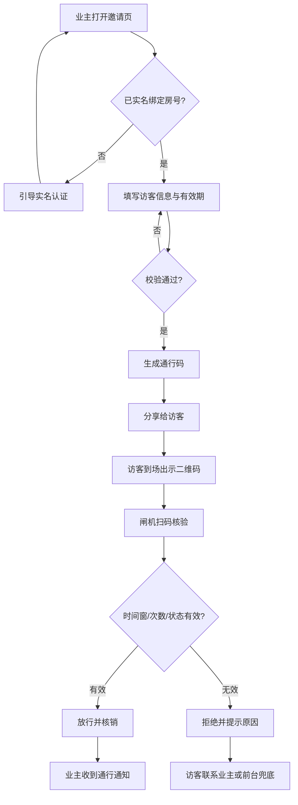
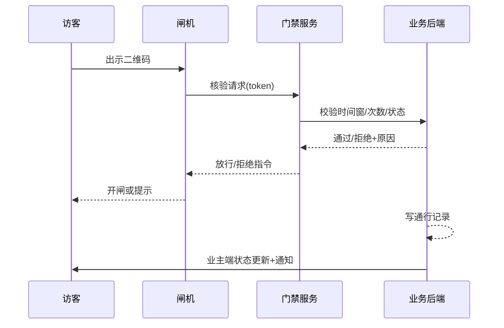

# PRD：物业小程序「访客邀请」功能

| 文档信息 | 内容 |
|---|---|
| 版本 | v0.1（草稿） |
| 状态 | 待评审 |
| 本期范围 | 人行访客邀请 + 通行码（不含车辆、审批流） |
| 变更记录 | 首次创建 |

## 1. 背景与目标

### 1.1 业务背景
传统访客管理依赖前台人工登记：访客到门口排队等业主下楼接人、前台手工登记效率低、纸质记录无法追溯。物业小程序已有业主端入口，访客通行是业主高频、强感知的服务场景之一。

> 【假设】小区人行出入口以二维码闸机为主，且物业小程序已具备业主实名认证与房号绑定体系。以上待与物业方确认（见 9.2）。

### 1.2 产品目标
| 指标 | 目标（建议值） | 说明 |
|---|---|---|
| 访客自助通行率（北极星） | ≥ 70%（上线 3 个月） | 自助扫码通行人次 / 全部访客人次，直接反映前台减负 |
| 邀请功能渗透率 | ≥ 30%（活跃业主） | 衡量业主端使用习惯养成 |
| 核验失败率（护栏） | ≤ 2% | 含过期、撤销、系统异常导致的失败 |

### 1.3 非目标（本期明确不做）
- 访客车辆通行与车牌识别（二期评估）
- 物业/业主审批流（本期信任业主直接发放）
- 长期访客管理（家属、月卡、常驻家政）
- 电梯联动、访客停车缴费

## 2. 用户与场景

### 2.1 目标用户
| 用户角色 | 特征 | 核心诉求 |
|---|---|---|
| 业主/住户 | 已实名绑定房号，小程序活跃用户 | 朋友、家政来访时不用下楼接人 |
| 访客 | 非小区常住人员，无小程序账号 | 到门口能快速进入，不排队登记 |
| 物业前台/秩序员 | 处理现场异常与兜底 | 有依据地核验放行，留痕可查 |

### 2.2 核心使用场景
1. **周末朋友来访**：周五晚上业主提前填好访客信息，周六朋友扫码即进，业主无需下楼。
2. **家政/维修按点上门**：业主为钟点工设置当天有效期的通行码，服务结束自动失效。
3. **现场异常兜底**：访客码过期或未收到邀请时，前台按手机号查询邀请记录人工放行。

### 2.3 用户故事
| 编号 | 用户故事 | 优先级 | 验收要点 |
|---|---|---|---|
| US-01 | 作为业主，我希望提前填写访客信息生成通行码，以便访客到访不用我下楼接 | P0 | 邀请创建成功率、码生成时效 |
| US-02 | 作为访客，我希望收到二维码并在到达时扫码通行，以便不排队等前台登记 | P0 | 无需登录即可查看通行码 |
| US-03 | 作为业主，我希望设定通行码的有效时间和使用次数，以便访客只能在约定时间进入 | P0 | 过期/超次核验拒绝 |
| US-04 | 作为业主，我希望看到邀请记录和访客通行状态，以便知道访客到了没有 | P1 | 状态实时更新 |
| US-05 | 作为物业前台，我希望能人工核验异常通行码并留痕，以便处理现场兜底 | P1 | 操作记录可查 |
| US-06 | 作为业主，我希望常用访客可保存后一键再邀请，以便重复邀请不用重复填写 | P2 | 本期仅做数据存储，入口二期 |

## 3. 需求范围

### 3.1 功能清单
| 编号 | 功能模块 | 功能点 | 优先级 | 说明 |
|---|---|---|---|---|
| F-01 | 邀请管理 | 创建邀请（访客姓名、手机号、到访时间、有效期、随行人数） | P0 | 见 5.1 |
| F-02 | 通行码 | 生成动态二维码（时间窗 + 次数限制） | P0 | 见 5.2 |
| F-03 | 访客端 | 短信/微信分享，访客免登录查看通行码 | P0 | 见 5.3 |
| F-04 | 门禁核验 | 闸机扫码核验与放行（对接门禁系统） | P0 | 见 5.4，前置依赖 |
| F-05 | 邀请记录 | 业主端邀请列表与通行状态 | P1 | 见 5.5 |
| F-06 | 现场兜底 | 物业端查询与人工核销 | P1 | 见 5.6 |
| F-07 | 常用联系人 | 访客信息保存与复用 | P2 | 本期仅落库，不做入口 |

### 3.2 范围外
车辆通行、审批流、黑白名单、访客停车缴费：转二期需求池；电梯联动：暂无规划。

## 4. 业务流程

核验环节涉及访客、闸机、门禁服务、业务后端四方协作，时序如下：

## 5. 功能详述

### 5.1 创建邀请（F-01）
**描述**：业主填写访客信息，生成一次可核验的邀请。
**交互与规则**：
- 入口：小程序服务页「访客邀请」。
- 字段：访客姓名（必填，≤ 20 字）、手机号（必填，11 位校验）、预计到访日期（必填）、有效期（默认到访日 00:00–23:59，可选 2 小时 / 4 小时 / 当天 / 自定义）、随行人数（默认 1，上限 5，超出建议分次邀请【建议值】）、备注（选填）。
- 限制：每户每日有效邀请 ≤ 10 个【建议值，防滥用】；创建后访客手机号不可修改，只能撤销后重新邀请。

**边界与异常**：未实名账号进入引导实名；达到每日上限给出次日提示；提交超时保留表单内容。

### 5.2 通行码（F-02）
**描述**：以动态二维码为载体的限时限次通行凭证。
**交互与规则**：
- 码内容为加密 token（邀请 ID + 时间窗 + 剩余次数 + 防重放因子），每 60 秒自动刷新【建议值，防截图转发冒用】。
- 单码默认核销 1 次；随行人数 > 1 时按人数设定核销次数。
- 状态机：待生效 → 生效中 → 已使用 / 已过期 / 已撤销。

**边界与异常**：访客手机时间不准不影响校验，一律以门禁服务端时间为准。

### 5.3 访客端（F-03）
**描述**：访客通过分享链接免登录查看通行码。
**交互与规则**：分享支持短信短链与微信卡片；打开页展示小区名、楼栋、有效期、通行码；到期前 30 分钟页面顶部提示【建议值】。

**边界与异常**：链接过期后页面显示失效说明与物业电话；访客打开行为不采集手机号以外的个人信息。

### 5.4 门禁核验（F-04）
**描述**：闸机扫码 → 门禁服务 → 业务后端的在线校验链路（见第 4 节时序图）。
**交互与规则**：
- 校验维度：时间窗、剩余次数、邀请状态、访客黑名单（如物业侧有）。
- 核验接口 P95 响应 ≤ 800ms【建议值】；超时闸机按拒绝处理并提示联系前台。

**边界与异常**：门禁服务不可用时走人工兜底（5.6）；离线校验策略依赖门禁硬件能力，待确认（见 9.2）。

### 5.5 邀请记录（F-05）
业主端按状态（待到访 / 已通行 / 已过期 / 已撤销）查看邀请列表，已通行的展示通行时间。

### 5.6 现场兜底（F-06）
物业工作台按访客手机号查询邀请，人工核销放行并强制选择核销原因（码过期 / 未收到邀请 / 系统异常），操作留痕可审计。权限仅限物业角色。

## 6. 非功能需求
- **性能**：核验链路 P95 ≤ 800ms【建议值】；邀请创建提交 P95 ≤ 1s。
- **安全**：token 加密防篡改、防重放；业主端手机号脱敏展示（138****5678）。
- **合规**：访客姓名与手机号仅在邀请页明示用途后收集；分享链接限时失效；访客通行数据保留 ≤ 90 天【建议值，遵循个人信息最小必要原则，待法务确认】。
- **兼容**：兼容主流二维码闸机；具体型号适配范围待物业确认。

## 7. 数据埋点与指标

### 7.1 北极星指标与护栏指标
| 指标 | 定义 | 目标值（建议） |
|---|---|---|
| 访客自助通行率（北极星） | 自助扫码通行人次 / 全部访客人次 | ≥ 70%（3 个月） |
| 邀请渗透率 | 当月发出邀请的业主 / 活跃业主 | ≥ 30% |
| 核验失败率（护栏） | 拒绝+异常核验 / 总核验 | ≤ 2% |
| 人工兜底次数（护栏） | 前台人工核销量 | 环比下降 |

### 7.2 埋点事件表
| 事件名 | 触发时机 | 事件属性 | 分析用途 |
|---|---|---|---|
| invite_create_submit | 业主提交邀请表单 | 随行人数、有效期类型、入口来源 | 创建转化与入口优化 |
| invite_share_click | 业主点击分享 | 分享渠道（短信/微信） | 渠道触达效果 |
| visitor_code_open | 访客打开通行码页 | 距到访时间间隔 | 访客端触达时机 |
| gate_verify_result | 门禁核验返回 | 结果、失败原因、响应耗时 | 自助通行率与失败归因 |
| fallback_manual_verify | 前台人工核销 | 核销原因 | 兜底压力与体验短板 |

核心漏斗：邀请创建 → 分享 → 访客打开 → 扫码 → 通行成功。

## 8. 验收标准
| 编号 | 关联功能 | Given | When | Then |
|---|---|---|---|---|
| AC-01 | F-01 | 业主已实名绑定房号 | 提交完整邀请信息 | 生成"待生效"邀请并出现在列表中 |
| AC-02 | F-04 | 通行码在有效期内且未核销 | 访客在闸机扫码 | 放行、码核销、业主收到通行通知 |
| AC-03 | F-04 | 通行码已过有效期 | 访客扫码 | 拒绝并提示"已过期"，页面引导联系业主或前台 |
| AC-04 | F-04 | 通行码已核销或已撤销 | 访客再次扫码 | 拒绝并提示对应原因 |
| AC-05 | F-01 | 邀请已创建 | 业主尝试修改访客手机号 | 不支持修改，引导撤销后重新邀请 |
| AC-06 | F-01 | 当日邀请已达上限 | 业主再次创建 | 提示已达上限并说明次日恢复 |
| AC-07 | F-06 | 门禁服务不可用 | 访客扫码 | 闸机提示联系前台，前台可查询并人工核销放行 |
| AC-08 | F-01 | 账号未实名或未绑定房号 | 打开邀请页 | 拦截并引导完成实名认证 |

## 9. 风险与开放问题

### 9.1 风险
| 风险 | 影响 | 应对 |
|---|---|---|
| 门禁硬件型号与对接排期不可控 | P0 依赖，直接威胁月底上线 | 立即确认门禁品牌与对接方式；准备"纯软件+人工核验"降级方案 |
| 访客个人信息合规风险 | 法务风险 | 收集页面明示用途、链接限时失效、数据限留 90 天，上线前过法务 |
| 通行码被截图转发冒用 | 安全漏洞 | 动态刷新 + 次数核销，异常高频核验触发风控告警 |

### 9.2 开放问题与假设
| 编号 | 问题/假设 | 待确认人 | 影响 |
|---|---|---|---|
| Q1 | 【假设】小程序已有实名认证与房号绑定体系 | 产品/研发 | 决定入口与权限设计 |
| Q2 | 门禁硬件品牌、型号及是否支持二维码在线核验 | 物业/采购 | P0 前置依赖，月底上线关键路径 |
| Q3 | 【假设】每户每日邀请上限 10 次合理 | 物业运营 | 防滥用策略 |
| Q4 | 【建议】访客数据保留 90 天 | 法务 | 个保法合规 |
| Q5 | 离线状态下的闸机校验策略 | 研发/硬件商 | 安全与可用性兜底 |
